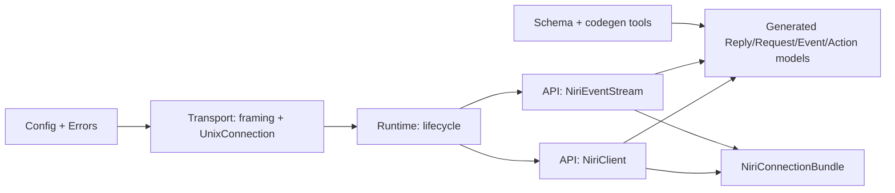

# Deep Research Report on `niri-state_v1` and `niri-pypc`

## Executive summary

Both repositories are thoughtfully structured and materially functional, but they are not equally mature.

`niri-pypc` is the stronger codebase today. It has a clean transport/runtime/API layering, generated protocol models pinned to an upstream schema version, good tests, and a clear error taxonomy. Its main correctness flaw is significant: the advertised `max_frame_size` is not actually honored for frames above asyncio’s default stream limit, so large replies or events can fail with `LimitOverrunError` long before the configured 4 MiB limit is reached (`niri-pypc/src/niri_pypc/config.py:22-28`, `niri-pypc/src/niri_pypc/api/client.py:48-69`, `niri-pypc/src/niri_pypc/api/event_stream.py:75-93`, `niri-pypc/src/niri_pypc/transport/connection.py:30-41`, `82-142`). I reproduced this locally with a 70 KB mock reply.


The short version:

- `niri-pypc`: **good foundation, one high-priority transport bug, several packaging/typing improvements**
- `niri-pypc`: fix transport limit bug, tighten packaging/CI, then release candidate


### Local execution status

| Repository | Test result | Notes |
|---|---:|---|
| `niri-pypc` | All collected tests passed; 3 live tests skipped | Live tests are gated on `NIRI_SOCKET` (`niri-pypc/tests/live/test_live.py:16-19`) |

| `niri-pypc` static/runtime sanity | `compileall` passed; generated-code verification passed | `tools/verify_generated.py` reported generated code up to date |

### Coverage signal from repository test runs

The absolute pass rate is good, but the coverage distribution shows important blind spots.

- `niri-pypc`’s coverage is good overall, but gaps remain in `api/event_stream.py`, `transport/connection.py`, and the generated model edge paths.

## Architecture and integration assessment

The macro-architecture is good in both repos. The problem is not conceptual direction; it is operational completion.

### `niri-pypc` architecture

`niri-pypc` follows a clean layered design:



This is a strong separation of concerns:

- configuration and socket discovery are isolated (`niri-pypc/src/niri_pypc/config.py:1-41`)
- framing is isolated from socket transport (`niri-pypc/src/niri_pypc/transport/framing.py:1-33`)
- lifecycle is encapsulated (`niri-pypc/src/niri_pypc/runtime/lifecycle.py:11-91`)
- public APIs are thin wrappers over transport and models (`niri-pypc/src/niri_pypc/api/client.py:17-85`, `event_stream.py:50-282`, `bundle.py:12-70`)

This is the main reason the repository tests well and will be easy to maintain.

## Detailed findings by severity and module

### Summary table

| Severity | Repo | Module / file | Finding | Impact | Effort |
|---|---|---|---|---|---|
| High | `niri-pypc` | `transport/connection.py`, `api/client.py`, `api/event_stream.py` | `max_frame_size` is not honored above asyncio’s default stream limit | Large replies/events can fail unexpectedly | S |
| Low | `niri-pypc` | `types/__init__.py` | Wildcard API export from generated types is broad and hard to stabilize | Noisy public namespace | M |
| Low | `niri-pypc` | docs | `niri-pypc` docs are decent but incomplete on limits and lifecycle | Adoption friction | S |

### High severity findings

#### Transport frame-size bug in `niri-pypc`

`NiriConfig.max_frame_size` defaults to 4 MiB (`niri-pypc/src/niri_pypc/config.py:22-28`), and both client and event stream pass that into `read_frame()` (`niri-pypc/src/niri_pypc/api/client.py:63-66`, `api/event_stream.py:123-126`). But `UnixConnection.connect()` opens the stream with default `asyncio.open_unix_connection()` settings and does not set the stream `limit` (`niri-pypc/src/niri_pypc/transport/connection.py:30-41`). `read_frame()` then uses `StreamReader.readuntil(b"\n")` (`transport/connection.py:95-99`), which is constrained by asyncio’s stream limit, not by `max_frame_size`.

Result: replies larger than about 64 KiB can fail with `asyncio.LimitOverrunError` before your configured max frame size is reached. I reproduced this locally with a 70 KB mock reply.

This is both a correctness and reliability issue, and it directly affects `niri-state_v1` bootstrap, which makes requests for outputs/windows/workspaces that can become large.


### Low severity findings


#### Wildcard re-export in `niri-pypc.types`

`niri-pypc/types/__init__.py` re-exports generated types with `from ...generated import *` (`niri-pypc/src/niri_pypc/types/__init__.py:1-6`). This is convenient, but it makes the public namespace broad and potentially unstable across schema bumps.

#### Repository hygiene and metadata gaps

Niri-pypc declares `license = { text = "MIT" }` in `pyproject.toml`, but neither includes a `LICENSE` file in the archive (`niri-pypc/pyproject.toml:1-18`). It also has `project.urls` commented out, and does not include CI workflow files. 

## Concrete code changes, patches, and tests

The patches below are the highest-value changes to make first.

### Patch for `niri-pypc`: honor configured frame sizes

This is the highest-priority fix in `niri-pypc`.

```diff
diff --git a/src/niri_pypc/transport/connection.py b/src/niri_pypc/transport/connection.py
index 0000000..0000000 100644
--- a/src/niri_pypc/transport/connection.py
+++ b/src/niri_pypc/transport/connection.py
@@
-from niri_pypc.errors import NiriTimeoutError, ProtocolError, TransportError
+from niri_pypc.errors import NiriTimeoutError, ProtocolError, TransportError
+
+DEFAULT_STREAM_LIMIT = 64 * 1024
@@
     def __init__(
         self,
         reader: asyncio.StreamReader,
         writer: asyncio.StreamWriter,
         socket_path: Path,
+        *,
+        stream_limit: int = DEFAULT_STREAM_LIMIT,
     ) -> None:
         self._reader = reader
         self._writer = writer
         self._socket_path = socket_path
         self._closed = False
+        self._stream_limit = stream_limit
@@
     async def connect(
         cls,
         socket_path: Path,
         *,
         timeout: float = 5.0,
+        stream_limit: int | None = None,
     ) -> UnixConnection:
@@
-            reader, writer = await asyncio.wait_for(
-                asyncio.open_unix_connection(str(socket_path)),
+            limit = stream_limit if stream_limit is not None else DEFAULT_STREAM_LIMIT
+            reader, writer = await asyncio.wait_for(
+                asyncio.open_unix_connection(str(socket_path), limit=limit),
                 timeout=timeout,
             )
@@
-        return cls(reader, writer, socket_path)
+        return cls(reader, writer, socket_path, stream_limit=limit)
@@
         try:
             raw = await asyncio.wait_for(
                 self._reader.readuntil(b"\n"),
                 timeout=timeout,
             )
+        except asyncio.LimitOverrunError as exc:
+            self._closed = True
+            raise ProtocolError(
+                f"Frame exceeds maximum {max_size} bytes before delimiter",
+                operation="read_frame",
+                socket_path=str(self._socket_path),
+                cause=exc,
+            ) from exc
         except TimeoutError as exc:
             ...
```

```diff
diff --git a/src/niri_pypc/api/client.py b/src/niri_pypc/api/client.py
index 0000000..0000000 100644
--- a/src/niri_pypc/api/client.py
+++ b/src/niri_pypc/api/client.py
@@
         conn = await UnixConnection.connect(
             socket_path,
             timeout=self._config.connect_timeout,
+            stream_limit=max(self._config.max_frame_size + 1, 64 * 1024),
         )
```

```diff
diff --git a/src/niri_pypc/api/event_stream.py b/src/niri_pypc/api/event_stream.py
index 0000000..0000000 100644
--- a/src/niri_pypc/api/event_stream.py
+++ b/src/niri_pypc/api/event_stream.py
@@
         conn = await UnixConnection.connect(
             socket_path,
             timeout=config.connect_timeout,
+            stream_limit=max(config.max_frame_size + 1, 64 * 1024),
         )
```

Suggested tests:

```python
async def test_request_accepts_large_frame_within_max_size(self, mock_server):
    socket_path, ctrl = mock_server
    payload = "x" * 70000
    ctrl["response"] = json.dumps({"Ok": {"Version": payload}}).encode() + b"\n"

    config = NiriConfig(
        socket_path=socket_path,
        connect_timeout=5.0,
        request_timeout=5.0,
        max_frame_size=200000,
    )
    async with NiriClient.connect(config) as client:
        result = await client.request(VersionRequest())

    assert result.variant.payload == payload
```

```python
async def test_request_rejects_frame_over_max_size(self, mock_server):
    socket_path, ctrl = mock_server
    payload = "x" * 70000
    ctrl["response"] = json.dumps({"Ok": {"Version": payload}}).encode() + b"\n"

    config = NiriConfig(
        socket_path=socket_path,
        connect_timeout=5.0,
        request_timeout=5.0,
        max_frame_size=1024,
    )
    async with NiriClient.connect(config) as client:
        with pytest.raises(ProtocolError, match="Frame exceeds maximum"):
            await client.request(VersionRequest())
```

## Packaging, documentation, typing, and CI recommendations

### Packaging and dependency management

These should be done in both repos before public release.

| Item | Recommendation | Evidence |
|---|---|---|
| License file | Add `LICENSE` to both repos | `pyproject.toml` claims MIT but archive lacks license files |
| Project metadata | Uncomment and populate `project.urls`, add classifiers, keywords, and maintainers | both `pyproject.toml` files |
| Build verification | Add a release job that builds wheel + sdist and installs them into a clean env before publishing | no CI workflows present |


### Documentation

`niri-pypc` README is reasonably good and matches the tested API surface (`README.md`, `tests/api/test_client.py`, `tests/api/test_event_stream.py`, `tests/api/test_bundle.py`). The one major thing it should document is the framing/size model and the fact that event streams are one persistent connection with bounded queue/backpressure.

### CI

A minimal but strong CI matrix for both repos should include:

- Python 3.13 on Linux
- `pytest`
- `python -m compileall src tests`
- formatter/linter
- type checker
- package build smoke test

Suggested workflow stages - but configure via the devenv.nix:

```yaml
jobs:
  test:
    steps:
      - checkout
      - setup-python
      - install deps
      - run: pytest -q -ra
      - run: python -m compileall -q src tests

  lint:
    steps:
      - run: ruff check .
      - run: ruff format --check .

  typecheck:
    steps:
      - run: mypy .

  package:
    steps:
      - run: python -m build
      - run: python -m pip install dist/*.whl
      - run: python -c "import niri_pypc; import niri_state"
```

For `niri-pypc`, add a generated-code consistency job:

```yaml
- run: python tools/verify_generated.py
```

## Implementation plan, priorities, effort, and risk

### Recommended order

| Priority | Change | Repo | Effort | Risk | Why first |
|---|---|---|---|---|---|
| P0 | Fix stream-limit / frame-size bug | `niri-pypc` | 0.5 day | Low | Breaks large payloads and directly affects `niri-state_v1` bootstrap |
| P2 | Expand README/API docs | both | 0.5–1 day | Low | Critical for adoption |
| P2 | Add CI workflows + package smoke tests | both | 0.5–1 day | Low | Prevents regression |

## Open questions and limitations

A few things remain intentionally conservative in this report:

- I could not run the declared external lint/type tools (`ruff`, `mypy`, `ty`) in the offline environment, so the static-analysis conclusions are based on repository configs, `compileall`, targeted runtime probes, and manual source review rather than those exact tool outputs.
- Live compositor tests were skipped because `NIRI_SOCKET` was not available. Investigate the testing story for Niri - is there a standard way to test libraries without hijacking the developer's user environment?
- I did not treat generated protocol model internals as primary refactor targets unless they affected runtime/public API behavior; most of the important work is in transport/runtime layers around the generated code, not inside it.
- I did not recommend changing the one-connection-per-request command model in `niri-pypc`; it is clearly intentional (`README.md`, `api/client.py:17-22`) and should remain unless performance measurements justify a different protocol client mode.

Overall judgment:

- `niri-pypc`: **good and close**
