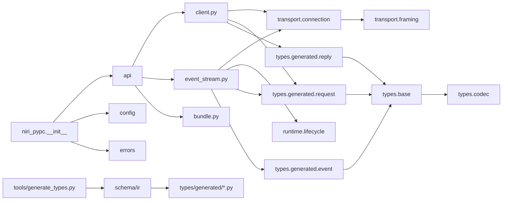
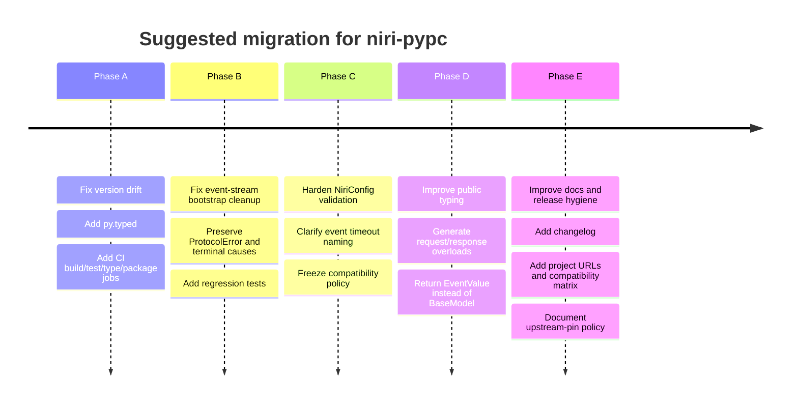

# Expert Code Review of niri-pypc

## Executive summary

`niri-pypc` is a thoughtfully structured library with a clean separation between transport, lifecycle, API surface, and generated protocol types. The generated-model strategy is strong: top-level IPC envelopes are represented as Pydantic `RootModel`s, custom serialization is centralized in one handwritten base layer, and the code correctly uses `model_validate_json()` on raw JSON bytes, which is the fast path Pydantic recommends for most JSON inputs. The transport layer is also appropriately small and focused, and the test suite is substantially better than average for a young library: in local execution on Python 3.13, the suite passed with 95% line coverage when the package was importable from `src/`. Using `RootModel`, `model_validator`, and `model_serializer` in this way is aligned with current entity["organization","Pydantic","validation library"] guidance. citeturn6view0turn7view0turn7view2turn10view0turn4view3

The codebase’s biggest problems are not architectural complexity; they are a handful of sharp correctness and packaging edges that will matter immediately in real use. The most important are: a release-version mismatch (`pyproject.toml` says `0.2.0`, `src/niri_pypc/_version.py` says `0.1.0`), missing `py.typed` packaging for an explicitly typed library, two event-stream lifecycle bugs, and an API/typing surface that is more weakly typed than it needs to be. The library also declares `requires-python = ">=3.13"` even though the source mostly reads as “modern 3.12+ code” rather than “strictly 3.13-only code”; that may be intentional, but the reason is not documented. The type syntax in `types/base.py` and generated code relies on modern typing features from PEP 585 and PEP 695, so this is definitely **not** a 3.9+ codebase despite the user-supplied default assumption. citeturn4view1turn11search6turn14view2

My overall assessment is: **good foundation, not yet release-hardened**. If the maintainers fix the high-severity issues below, add a minimal CI/release pipeline, and make the compatibility policy explicit, this can become a very solid niche protocol client quickly.

| Area | Assessment | Notes |
|---|---|---|
| Architecture | Strong | Good module boundaries; generated vs handwritten code split is sensible. |
| API design | Mixed | Async-only direction is coherent, but `connect()`/`open()` semantics are inconsistent. |
| Pydantic usage | Good with caveats | RootModel/serializer design is strong; strictness/forward-compatibility policy is unclear. |
| Typing | Good internally, weak externally | Modern syntax is used well, but public result typing is broader than necessary. |
| Correctness | Mixed | Core happy path works; event-stream terminal-error handling has real bugs. |
| Tests | Strong | Broad coverage and realistic fixtures; a few important regression gaps remain. |
| Packaging | Weak | Version drift, no `py.typed`, no project URLs/classifiers/changelog, no CI in archive. |
| Docs | Fair | README is decent; API reference, compatibility policy, and migration notes are missing. |

## Repository and architecture review

The repository layout is easy to understand and, overall, quite healthy:



The most successful design choice is the split between:

- **handwritten runtime substrate** (`api`, `transport`, `errors`, `runtime`, `types/base.py`, `types/codec.py`), and
- **generated protocol surface** (`types/generated/*`).

That split keeps protocol drift localized and makes regeneration feasible. It is exactly the kind of boundary that works well for IPC libraries pinned to an upstream schema.

The top-level IPC framing also matches the upstream niri IPC contract correctly: the official IPC docs describe newline-delimited JSON over a Unix socket, with `Ok`/`Err` replies and an `event-stream` mode. The design in `transport.connection.py`, `api.client.py`, and `api.event_stream.py` maps neatly onto that contract. citeturn4view3turn4view7

The main architectural tradeoff is the request path: `NiriClient` uses a **one-connection-per-request** model, while `NiriEventStream` keeps a persistent connection. That is a defensible default for correctness and concurrency isolation, but it is a performance hot spot if callers issue many requests in bursts, because socket connect/open/close becomes the dominant cost rather than Pydantic validation. Since Pydantic itself notes that validation is often not the bottleneck, the transport setup cost is likely to dominate sooner than model work does. citeturn10view0turn4view3

A second architectural tension is compatibility policy. The README says the library is pinned to a precise upstream `niri-ipc` version, which supports exact-schema generation. The upstream niri IPC docs, however, also explicitly state that existing JSON output should remain stable while **new fields and enum variants may be added**, and clients should handle unknown fields or variants gracefully where reasonable. Today, `ProtocolModel` sets `extra="forbid"`, so known objects will reject newly added fields. That is a valid “exact pin” policy, but it should be explicit because it is stricter than the upstream JSON compatibility guidance. citeturn4view3turn4view8

## Detailed findings by module and area

### API layer

`src/niri_pypc/api/client.py` is intentionally simple and largely correct. The request method resolves the socket path, opens a connection with a stream limit tied to `max_frame_size`, serializes a `Request`, validates the `Reply`, unwraps, and closes in a `finally`. That is exactly the right control flow for a conservative IPC client.

The main API issue is **ergonomic inconsistency**. `NiriClient.connect()` is synchronous and returns a configured object; `NiriEventStream.connect()` is asynchronous and performs I/O; `NiriConnectionBundle.open()` is also asynchronous. A user has to remember three different creation semantics:

- `async with NiriClient.connect(config) as client`
- `async with await NiriEventStream.connect(config) as stream`
- `async with await NiriConnectionBundle.open(config) as bundle`

That is workable, but not elegant. The current API is conceptually coherent only if you think of `NiriClient` as a stateless request factory rather than a real connection. I would either rename `NiriClient.connect()` to `create()`/`from_config()` or introduce a private explicit `_socket_path` field so that “connect” means something consistently.

There is also a typing opportunity here. `request()` returns `ResponseValue`, a union of every possible reply variant. That is correct, but not very Pythonic for library consumers. The standard library typing docs make `@overload` the right tool when a function’s return type depends on its argument shape. This library is generated from an IR, so request→response overloads are automatable. citeturn14view2turn11search0

### Event stream and lifecycle correctness

This is the weakest part of the library today.

The first bug is in `src/niri_pypc/api/event_stream.py` during connect/bootstrap. The method sets `instance._connection = conn` and then calls `_bootstrap(conn)`. If `_bootstrap()` raises—for example because the server sends a malformed bootstrap reply or the wrong successful variant—the method exits **without closing the connection and without transitioning lifecycle state to a terminal state**. That is a resource-cleanup bug and a lifecycle-consistency bug.

The second bug is more serious: `_run_reader()` does not correctly preserve all terminal failures. It catches `TransportError`, `NiriTimeoutError`, and JSON decode failures, but it does **not** catch `ProtocolError` from `UnixConnection.read_frame()` or other unexpected exceptions. In those cases, the reader task dies, `_close_reader_resources()` runs, and the consumer later receives a generic “stream is closed” `LifecycleError` instead of the actual root cause. In local reproduction, an oversized event frame produced an internal task exception, `stream._terminal_cause` remained `None`, and `await stream.next()` raised only `LifecycleError`. That is exactly the kind of bug that turns a debuggable protocol failure into a vague support ticket.

There is also a naming issue around `event_read_timeout` in `NiriConfig`. In practice, this is not a socket read timeout; it is the timeout used by `next()` while waiting on the internal queue. That distinction matters. The current name suggests transport-level inactivity timeout, but the implementation behaves as consumer-side wait timeout.

`src/niri_pypc/runtime/lifecycle.py` is otherwise okay, but its docstring claims thread-safety because it uses `asyncio.Lock`. That claim is wrong according to the asyncio docs: `asyncio.Lock` is for asyncio tasks and is **not thread-safe**. Likewise, `asyncio.Queue` is not thread-safe, and `maxsize <= 0` means an infinite queue. Those details matter because they interact with `event_queue_capacity` validation and backpressure semantics. citeturn4view4turn4view5turn1search4

### Pydantic models and validation strategy

This is where the library is strongest conceptually.

`src/niri_pypc/types/base.py` uses a `ProtocolModel(BaseModel)` base, a generic `ExternallyTaggedEnum(RootModel[...])`, a `model_validator(mode="before")` to decode tagged unions, and a `model_serializer(mode="plain")` to re-emit the external-tagged representation. This is exactly the right place to concentrate protocol-shape logic. Pydantic’s docs describe `RootModel` as the model form for root objects, and the code uses it well. Likewise, using `model_validator` and `model_serializer` reflects current Pydantic v2 practice rather than legacy v1 patterns. The absence of `root_validator` usage is a positive, not a gap. citeturn6view0turn7view0turn7view1turn7view2

`src/niri_pypc/types/codec.py` is also well judged. It is metadata-driven, avoids field-shape heuristics, and cleanly separates decode/encode concerns. This is exactly the kind of “small handwritten core, large generated perimeter” design that scales.

The caveat is **strictness policy**. `ProtocolModel` sets `strict=False`. Pydantic’s strict-mode guidance is clear that lax mode will coerce values where possible; that is useful for many user-input scenarios, but protocol clients are often better served by failing fast on shape/type drift. In local validation, known event payloads accepted coerced values such as `"1"` for an `int` field. That may be acceptable for outbound request construction ergonomics, but it is less attractive for inbound protocol safety. At minimum, the project should document the tradeoff. Better still, it should decide explicitly between:

- **exact, strict schema validation**, or
- **tolerant inbound decoding** for forward compatibility.

Right now it is in an awkward middle state: it is lax about scalar coercion, but strict about extra keys (`extra="forbid"`). That means it can silently coerce wrong scalar types yet reject benign upstream additive changes. Pydantic supports strict mode at the model, field, or validation-call level, so the library has room to tune this deliberately. citeturn4view0turn4view9turn4view8

### Typing quality

The internal typing style is modern and mostly idiomatic. The code correctly uses built-in generics (`list[...]`, `dict[...]`) rather than old `typing.List`/`typing.Dict`, which is what PEP 585 intended. It also uses explicit type aliases and the modern PEP 695 type-parameter syntax (`class ExternallyTaggedEnum[RootT: ProtocolModel](...)` and `type VariantKind = ...`). That is clean, concise, and idiomatic for current Python. citeturn11search6turn4view1turn14view2

However, those same choices mean the code is **modern by construction**. This is not a “3.9+ unless otherwise” codebase; the syntax alone requires a much newer interpreter. The genuinely important review question therefore is not “is it modern?” but “is the minimum supported version documented and justified?” Today the answer is only partially yes: `pyproject.toml` says `>=3.13`, Ruff and Ty target 3.13, but the README does not explain why. From the source alone, the minimum looks closer to “3.12+ for PEP 695 syntax” than “3.13+ because a specific runtime feature is required.” That may be fine, but the rationale should be stated.

The largest typing weakness is consumer-facing precision:

- `NiriEventStream.next()` returns `BaseModel` instead of `EventValue`.
- `_EventItem.event` is typed `BaseModel` instead of the actual event union.
- `request()` returns a broad reply union instead of request-specific overloads.

These are not correctness bugs, but they reduce the value of an otherwise heavily typed library.

Finally, there is a packaging-level typing omission: the archive contains no `py.typed` marker. PEP 561 says packages that want their inline typing to be consumed by type checkers **must** ship `py.typed`. Without it, the library’s rich annotations may not propagate properly to downstream users. That is a high-value, low-effort fix. citeturn15view0turn15view1

### Transport, framing, and performance

`src/niri_pypc/transport/connection.py` is compact and mostly solid. It handles connect timeout, read timeout, EOF behavior, stream-limit overrun, and close idempotence reasonably well. `max_frame_size + 1` being fed into `open_unix_connection(limit=...)` is an especially good detail, because it aligns the reader’s internal limit with the protocol frame-size guard and avoids accidental truncation below the configured frame budget.

One small implementation oddity is that `src/niri_pypc/transport/framing.py` contains only `append_newline()` and is unused. With 0% coverage in the test report, it currently reads as dead code. Either wire it into serialization paths or delete it.

Performance-wise, the project already gets one big Pydantic choice right: it uses `model_validate_json()` instead of `json.loads(...)` followed by model validation. That aligns with Pydantic’s performance guidance. The likely remaining hotspot is transport churn, not validation. If high-rate request traffic becomes a goal, a persistent command socket or small connection pool would be the first design to revisit. citeturn10view0turn4view7

### Configuration, errors, logging, and security

`src/niri_pypc/config.py` is serviceable, but it is the least robust public model in the package. The project is explicitly Pydantic-heavy, yet its main user-facing configuration object is a plain frozen dataclass with no runtime validation. That leads to several practical problems:

- `socket_path` is annotated as `Path | None`, but callers can pass `str` and the object will happily store it.
- timeouts and sizes are unconstrained;
- `event_queue_capacity=0` or `<0` creates an infinite `asyncio.Queue`, which quietly disables the advertised bounded-queue/backpressure semantics;
- `NiriClient.connect()` validates `resolve_socket_path()` once but then discards the result and resolves again on each request, so an environment-based socket path can change after object construction.

This is the clearest place where a small Pydantic model would pay off immediately.

The error taxonomy in `src/niri_pypc/errors.py` is otherwise good. It has a coherent base type, preserves useful attributes like `operation`, `socket_path`, and `retryable`, and truncates raw payload excerpts to reduce log/exception bloat—good defensive practice for IPC clients. The main improvement I would recommend is better surfacing of structured context in `__str__` or `__repr__`, because today most of that context is available only if the caller knows to inspect attributes.

The logging story is sparse but acceptable for a small library. There is one warning on event drop; otherwise it is intentionally quiet. That is a sensible default. I would add optional debug logging around connect/bootstrap/close transitions before adding anything more elaborate.

From a security perspective, the code is low risk. It talks to a local Unix socket, imposes a frame-size ceiling, avoids dynamic code execution, and never shells out in the library runtime. The main protocol-security improvement is stricter or more explicit validation policy, not sandboxing.

### Tests, CI, packaging, and documentation

The test suite is a real asset. It includes:

- narrow unit/contract tests around codecs and generated models,
- socket-level integration tests,
- nested compositor tests with realistic scenarios,
- live tests gated on `NIRI_SOCKET`,
- hardening tests for the nested harness.

That is excellent breadth for a library this size. The fixture design is also sound: fake Unix servers are used instead of only monkeypatching internals, which gives better confidence in transport correctness.

The biggest missing tests are regression tests for the exact bugs above:

- bootstrap failure closes the connection and leaves the object terminal,
- oversized/invalid event frames preserve the real terminal exception,
- version metadata stays in sync,
- `py.typed` is included in built artifacts,
- forward-compatibility behavior for additive fields is either accepted or intentionally rejected.

CI, however, is absent from the archive. I found no GitHub Actions, GitLab CI, tox, or nox configuration. That means there is no visible automated enforcement of tests, type checks, formatting, regeneration freshness, or packaging integrity. Given the code generator and schema pinning, that is a bigger problem than it would be for a handwritten-only library.

Packaging is modern enough to be salvageable because `pyproject.toml` uses the `[project]` table and a modern build backend. But metadata is thin: no active `[project.urls]`, no classifiers, no documented changelog, no `py.typed`, and a duplicated version source that has already drifted. PyPA’s guidance strongly favors modern `pyproject.toml` metadata, single-sourced versions, well-known project URLs, and standard build tooling. The current package metadata falls short of that baseline. citeturn4view2turn12view0turn12view1turn12view2turn12view3turn12view4

Documentation is adequate for an initial release but not for a stable public library. The README is better than average and includes examples, architecture notes, and regeneration steps. Still missing are:

- a compatibility-policy section explaining Python-version support and upstream niri pinning,
- API reference docs,
- deprecation/backward-compatibility notes,
- a changelog,
- a short “typed usage” section explaining what is intentionally public.

## Prioritized issues

| Severity | Issue | Impact | Suggested fix |
|---|---|---|---|
| High | `project.version` and `__version__` disagree (`0.2.0` vs `0.1.0`) | Runtime metadata is wrong; packaging/debugging confusion; release hygiene failure | Single-source versioning via build backend or `importlib.metadata.version()` fallback; add a test. citeturn12view0turn4view6 |
| High | Missing `py.typed` | Downstream type checkers may not treat the installed package as typed | Ship `py.typed` in the wheel/sdist and verify in CI. citeturn15view0turn15view1 |
| High | `NiriEventStream` loses terminal `ProtocolError`/unexpected reader exceptions | Users see generic close errors instead of the real protocol failure | Catch broad reader exceptions, set `_terminal_cause`, enqueue terminal error, assert with tests. |
| High | `NiriEventStream.connect()` leaks resources on bootstrap failure | Socket/resource leak and inconsistent lifecycle state | Wrap bootstrap in `try/except`, close connection, transition lifecycle to `CLOSED`, re-raise. |
| Medium | `NiriConfig` has no runtime validation | Silent type drift, invalid capacities/timeouts, surprising env-based behavior | Convert to Pydantic model or add `__post_init__` validation; enforce positive bounds. citeturn4view5turn4view8turn4view9 |
| Medium | Public API typing is broader than necessary | Poor IDE/type-checker UX for library consumers | Generate request→response overloads and change event methods to `EventValue`. citeturn14view2 |
| Medium | Forward-compatibility policy is unclear and currently strict in the least helpful way | Benign upstream additive changes may break decoding | Decide between exact-pin strictness and tolerant inbound decoding; document it and test it. citeturn4view3turn4view8 |
| Medium | No visible CI pipeline in archive | No automated release safety net for generator drift, package metadata, or type quality | Add CI for tests, type checks, build, and generated-code verification. citeturn12view4turn12view3 |
| Low | `LifecycleManager` claims thread-safety incorrectly | Misleading docs; potential misuse from threaded code | Reword as “task-safe within one event loop”; do not claim thread-safety. citeturn4view4turn4view5 |
| Low | `transport/framing.py` is effectively dead code | Maintenance clutter | Remove it or use it consistently in request/event emission. |

## Concrete refactors, patches, and test examples

### Patch for single-source versioning

The cleanest fix is to stop maintaining a manual `_version.py` that can drift. Either let Hatch derive the version dynamically, or derive runtime `__version__` from installed metadata and keep one declared build-time source of truth. PyPA explicitly recommends avoiding duplicated version data when the import package and distribution package are meant to share a version. citeturn12view0turn4view6

```diff
diff --git a/src/niri_pypc/__init__.py b/src/niri_pypc/__init__.py
@@
-"""niri-pypc: Python protocol client for the niri Wayland compositor."""
-
-from niri_pypc._version import __version__
+"""niri-pypc: Python protocol client for the niri Wayland compositor."""
+
+from importlib.metadata import PackageNotFoundError, version
+
+try:
+    __version__ = version("niri-pypc")
+except PackageNotFoundError:  # local source tree, not installed
+    __version__ = "0.2.0"
```

Add a regression test:

```python
from importlib.metadata import version as dist_version

import niri_pypc


def test_runtime_version_matches_distribution():
    assert niri_pypc.__version__ == dist_version("niri-pypc")
```

### Patch for event-stream bootstrap cleanup and terminal error preservation

This is the highest-value code fix.

```diff
diff --git a/src/niri_pypc/api/event_stream.py b/src/niri_pypc/api/event_stream.py
@@
     async def connect(
         cls,
         config: NiriConfig | None = None,
     ) -> NiriEventStream:
@@
         conn = await UnixConnection.connect(
             socket_path,
             timeout=config.connect_timeout,
             stream_limit=max(config.max_frame_size + 1, DEFAULT_STREAM_LIMIT),
         )
         instance._connection = conn
-
-        await instance._bootstrap(conn)
+        try:
+            await instance._bootstrap(conn)
+        except Exception:
+            await conn.close()
+            instance._connection = None
+            await mgr.transition_to(LifecycleState.CLOSED)
+            raise
@@
     async def _run_reader(self) -> None:
@@
         try:
             while True:
                 try:
                     raw = await conn.read_frame(
                         max_size=config.max_frame_size,
                         timeout=None,
                     )
-                except TransportError as exc:
-                    self._terminal_cause = exc
-                    self._enqueue_terminal(_ErrorItem(error=exc))
-                    return
-                except NiriTimeoutError as exc:
+                except (TransportError, NiriTimeoutError, ProtocolError) as exc:
                     self._terminal_cause = exc
                     self._enqueue_terminal(_ErrorItem(error=exc))
                     return
@@
-                try:
-                    event = Event.model_validate_json(raw)
-                except Exception as exc:
+                try:
+                    event = Event.model_validate_json(raw)
+                except Exception as exc:
                     terminal = DecodeError(
                         f"Failed to decode event: {exc}",
                         operation="event_stream_reader",
                         raw_payload=raw.decode("utf-8", errors="replace") if isinstance(raw, bytes) else str(raw),
                         cause=exc,
                     )
                     self._terminal_cause = terminal
                     self._enqueue_terminal(_ErrorItem(error=terminal))
                     return
+        except Exception as exc:
+            self._terminal_cause = exc
+            self._enqueue_terminal(_ErrorItem(error=exc))
+            return
         finally:
             await self._close_reader_resources()
```

Tests to add:

```python
async def test_event_stream_bootstrap_failure_closes_connection(mock_event_server):
    socket_path, ctrl = mock_event_server
    ctrl["bootstrap_reply"] = {"Ok": {"Version": "25.11"}}  # wrong bootstrap reply

    with pytest.raises(ProtocolError):
        await NiriEventStream.connect(NiriConfig(socket_path=socket_path))

async def test_oversize_event_propagates_protocol_error(temp_socket_path):
    async def handler(reader, writer):
        await reader.readuntil(b"\n")
        writer.write(b'{"Ok":{"Handled":{}}}\n')
        await writer.drain()
        writer.write(b"x" * 2000 + b"\n")
        await writer.drain()
        writer.close()

    server = await asyncio.start_unix_server(handler, path=str(temp_socket_path))
    try:
        stream = await NiriEventStream.connect(
            NiriConfig(socket_path=temp_socket_path, max_frame_size=100)
        )
        with pytest.raises(ProtocolError):
            await stream.next(timeout=1.0)
    finally:
        server.close()
        await server.wait_closed()
```

### Patch for configuration validation

Because this library already depends on Pydantic, the simplest path is to make `NiriConfig` a small frozen model. This improves correctness more than almost any other low-effort change.

```diff
diff --git a/src/niri_pypc/config.py b/src/niri_pypc/config.py
@@
 import enum
 import os
-from dataclasses import dataclass
 from pathlib import Path
 
+from pydantic import BaseModel, ConfigDict, PositiveFloat, PositiveInt
+
 from niri_pypc.errors import ConfigError
@@
-@dataclass(frozen=True, slots=True)
-class NiriConfig:
+class NiriConfig(BaseModel):
     """Configuration for niri-pypc connections."""
+
+    model_config = ConfigDict(frozen=True, extra="forbid")
 
     socket_path: Path | None = None
-    connect_timeout: float = 5.0
-    request_timeout: float = 10.0
-    event_read_timeout: float | None = None
-    max_frame_size: int = 4 * 1024 * 1024  # 4 MiB
-    event_queue_capacity: int = 256
+    connect_timeout: PositiveFloat = 5.0
+    request_timeout: PositiveFloat = 10.0
+    event_read_timeout: PositiveFloat | None = None
+    max_frame_size: PositiveInt = 4 * 1024 * 1024
+    event_queue_capacity: PositiveInt = 256
     backpressure_mode: BackpressureMode = BackpressureMode.DROP_OLDEST
```

This also fixes the current mismatch where a `str` can sneak into a `Path`-typed field unnoticed.

### Patch for type distribution and package metadata

```diff
diff --git a/pyproject.toml b/pyproject.toml
@@
 [project]
 name = "niri-pypc"
 version = "0.2.0"
 description = "Python controls for the Niri compositor."
 readme = "README.md"
 requires-python = ">=3.13"
 license = { text = "MIT" }
+classifiers = [
+  "Development Status :: 3 - Alpha",
+  "Intended Audience :: Developers",
+  "Programming Language :: Python :: 3",
+  "Programming Language :: Python :: 3.13",
+  "Operating System :: POSIX :: Linux",
+  "Typing :: Typed",
+]
+
+[project.urls]
+Homepage = "https://github.com/<owner>/niri-pypc"
+Repository = "https://github.com/<owner>/niri-pypc"
+Issues = "https://github.com/<owner>/niri-pypc/issues"
+Changelog = "https://github.com/<owner>/niri-pypc/blob/main/CHANGELOG.md"
@@
 [tool.hatch.build.targets.wheel]
 packages = ["src/niri_pypc"]
+
+[tool.hatch.build.targets.wheel.force-include]
+"src/niri_pypc/py.typed" = "niri_pypc/py.typed"
```

Create `src/niri_pypc/py.typed` as an empty file.

PyPA’s metadata and typing guidance supports all of these changes directly. citeturn12view1turn12view2turn15view0

### Request typing improvement

I would not hand-maintain overloads. I would generate them from the IR. The pattern should look like this:

```python
from typing import overload

@overload
async def request(self, req: VersionRequest, *, timeout: float | None = None) -> VersionResponse: ...
@overload
async def request(self, req: WorkspacesRequest, *, timeout: float | None = None) -> WorkspacesResponse: ...
@overload
async def request(self, req: FocusedWindowRequest, *, timeout: float | None = None) -> FocusedWindowResponse: ...

async def request(self, req: RequestValue, *, timeout: float | None = None) -> ResponseValue:
    ...
```

That makes the public library feel much more “pythonic” in editors and type checkers without changing runtime behavior. citeturn14view2

## Migration plan

A sensible migration does not require a big rewrite.



If backward compatibility is a concern, I would stage the changes like this:

| Phase | Breaking risk | Recommendation |
|---|---|---|
| Version, `py.typed`, CI, bootstrap cleanup, terminal-cause preservation | Very low | Ship immediately in the next patch release. |
| `NiriConfig` validation hardening | Low to medium | Ship with clear release notes; invalid configs failing fast is a net improvement. |
| Rename `event_read_timeout` to `next_timeout` or `event_wait_timeout` | Medium | Add alias/deprecation path for one minor release. |
| Public typing overloads | None at runtime | Ship immediately; typing-only improvement. |
| Relax `extra="forbid"` on inbound models | Medium to high | Decide only after documenting compatibility policy with upstream niri. |

## Appendix

### Step-by-step implementation guide

Start with release hygiene and trivially safe fixes. First, single-source the version and add a test comparing runtime `__version__` against the installed distribution version. Then add `py.typed`, wire it into wheel/sdist outputs, and add a CI job that builds the wheel and inspects its contents. PyPA specifically recommends single-sourced versions, modern `pyproject.toml` metadata, and standard build tooling. citeturn12view0turn12view3turn12view4

Next, fix the event-stream path. The order matters: close-on-bootstrap-failure first, then preserve broad terminal exceptions, then add tests. Do not refactor the queue/backpressure logic at the same time; keep the behavioral delta narrow so the regression tests remain interpretable.

After that, harden configuration. If you want to stay with a dataclass, add a `__post_init__` that coerces `socket_path` to `Path` and validates positivity for timeouts and sizes. If you want consistency with the rest of the project, move to a frozen Pydantic model and use constrained numeric types. Pydantic’s current config/strict-mode guidance supports this cleanly. citeturn4view8turn4view9

Then improve the public type experience. This library already has a schema IR and generation step; that generator should emit overloads, a `RequestToResponse` mapping type for docs/testing, and possibly a curated export surface. I would also change `NiriEventStream.next()` and iterator methods to return `EventValue` rather than `BaseModel`.

Finally, document the compatibility policy. At minimum, answer these three questions explicitly in the README and changelog:

1. Is the library intended to work only with the exact pinned `niri-ipc` version?
2. If not, should additive upstream fields/variants be tolerated?
3. Why is the Python floor `3.13` rather than `3.12`?

Without those answers, users cannot tell whether failures are bugs or policy.

### CI changes to add

A minimal CI matrix should include:

| Job | Purpose |
|---|---|
| `test` | `pytest` on supported Python versions |
| `type` | current type checker plus importability checks |
| `lint` | Ruff check/format check |
| `build` | `python -m build`, inspect wheel/sdist |
| `generated` | `tools/verify_generated.py` |
| `package-smoke` | install built wheel into a clean venv and import `niri_pypc` |

A compact GitHub Actions workflow skeleton:

```yaml
name: ci

on:
  push:
  pull_request:

jobs:
  test:
    runs-on: ubuntu-latest
    strategy:
      matrix:
        python-version: ["3.13"]
    steps:
      - uses: actions/checkout@v4
      - uses: actions/setup-python@v5
        with:
          python-version: ${{ matrix.python-version }}
      - run: python -m pip install -U pip build
      - run: python -m pip install -e .[dev]
      - run: pytest -q

  lint-and-type:
    runs-on: ubuntu-latest
    steps:
      - uses: actions/checkout@v4
      - uses: actions/setup-python@v5
        with:
          python-version: "3.13"
      - run: python -m pip install -U pip
      - run: python -m pip install -e .[dev]
      - run: ruff check .
      - run: ruff format --check .
      - run: ty check .
      - run: python tools/verify_generated.py

  build:
    runs-on: ubuntu-latest
    steps:
      - uses: actions/checkout@v4
      - uses: actions/setup-python@v5
        with:
          python-version: "3.13"
      - run: python -m pip install -U pip build
      - run: python -m build
```

If the maintainers later publish to PyPI, PyPA recommends standard build tooling and trusted publishing-capable CI platforms. citeturn12view4

### Design comparison tables

#### Configuration model choices

| Option | Pros | Cons | Recommendation |
|---|---|---|---|
| Frozen stdlib dataclass | Lightweight, fast, familiar | No validation, easy type drift, surprising bad configs | No longer ideal here |
| Pydantic dataclass | Keeps dataclass ergonomics, adds validation | Slightly more magic, less common than BaseModel in Pydantic-heavy libs | Reasonable |
| Frozen Pydantic BaseModel | Consistent with rest of project, best validation/documentation story | Slightly heavier object model | Best fit |

#### Command transport choices

| Option | Pros | Cons | Recommendation |
|---|---|---|---|
| One connection per request | Isolation, concurrency-safe, simple | Higher latency/overhead on bursts | Keep as default |
| Persistent command socket | Better throughput/latency | Harder lifecycle and recovery semantics | Consider as optional future enhancement |
| Small connection pool | Middle ground | More machinery, probably overkill now | Not yet necessary |

### Primary standards and documentation

The recommendations above are grounded primarily in the official niri IPC docs, current Pydantic docs, Python typing references/PEPs, and entity["organization","Python Packaging Authority","packaging standards body"] guidance:

- urlniri IPC docsturn4view3
- urlPydantic RootModel docsturn6view0
- urlPydantic validators docsturn6view1
- urlPydantic serialization docsturn6view2
- urlPydantic strict-mode docsturn4view0
- urlPydantic performance docsturn10view0
- urlPEP 585 built-in genericsturn11search6
- urlPEP 695 type-parameter syntaxturn4view1
- urlPEP 561 typed-package marker guidanceturn14view0
- urlPython asyncio lock docsturn4view4
- urlPython asyncio queue docsturn4view5
- urlPython asyncio streams docsturn4view7
- urlPython importlib.metadata docsturn4view6
- urlPyPA single-source version guidanceturn12view0
- urlPyPA pyproject guideturn4view2
- urlPyPA src-layout discussionturn4view10
- urlPyPA project URL guidanceturn12view1
- urlPyPA packaging flow guideturn12view3
- urlPyPA tool recommendationsturn12view4

### Open questions and limitations

This review is high-confidence on repository structure, code paths, tests, and metadata, but a few points remain policy questions rather than purely technical ones.

- I did not see CI configuration in the attached archive; if it exists outside the archive, the CI assessment would need updating.
- I could not perform a full isolated package build from the archive because the local environment did not have network access to fetch build dependencies, so the packaging review is based on `pyproject.toml`, source layout, and local import/test execution rather than a built wheel/sdist.
- The forward-compatibility recommendation around `extra="forbid"` depends on maintainer intent. If exact upstream pinning is the official policy, strict rejection of additive fields is defensible; if graceful compatibility with slightly newer niri releases is desired, it should be changed.